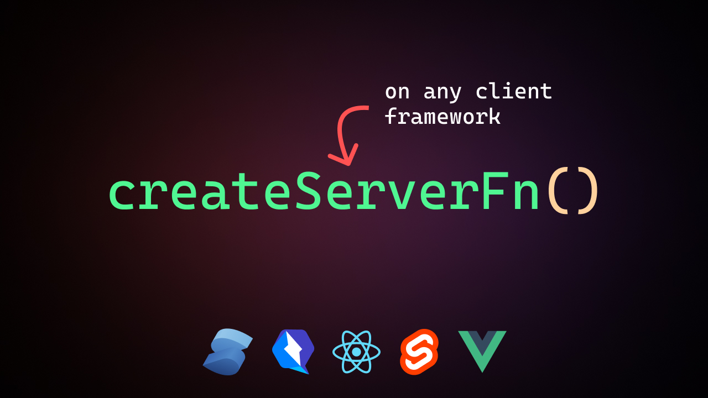

# Query Proxy - Beta

Lightweight Route Hanlders on any client framework; react, vue, svelte, qwik, solid, etc

## Important Notes ⚠️

- Currently still in development and should not be used in production
- Query proxy can currently only be deployed with vercel
- Better support for legacy applications and better typesafety would be available in the coming days
- Run the server locally to generate the "api/serverFn" folder in the root of your project before deploying to vercel

## Quick Guide 📖

- Installation:
  ```
  npm i query-proxy
  ```
- Setup:

  ```js
  import { defineConfig } from "vite";
  import react from "@vitejs/plugin-react-swc";
  import { queryProxy } from "query-proxy";
  import "./serverFn";

  export default defineConfig({
    plugins: [react(), queryProxy()],
  });
  ```

  In the root of your project create a serverFn.js file and add the following code

  ```js
  import { createServerFn } from "query-proxy";

  createServerFn("myFunction", async (req, res) => {
    console.log("Hello from the server user!");
    return res.status(200).json({
      message: "JavaScript logic executed on the server",
      timestamp: new Date(),
    });
  });
  ```

- To consume this function, it is provided as an endpoint on the client like so

```tsx
import { useEffect } from "react";

function App() {
  useEffect(() => {
    fetch("/api/serverFn/myFunction")
      .then((response) => response.json())
      .then((data) => console.log(data))
      .catch((error) => console.error("Error fetching data:", error));
  }, []);

  return (
    <div className="w-full min-h-[100vh] flex justify-center items-center">
      route handlers in react
    </div>
  );
}

export default App;
```

Where the createSeverFn name is the endpoint "/api/serverFn/`<function-name>`"
